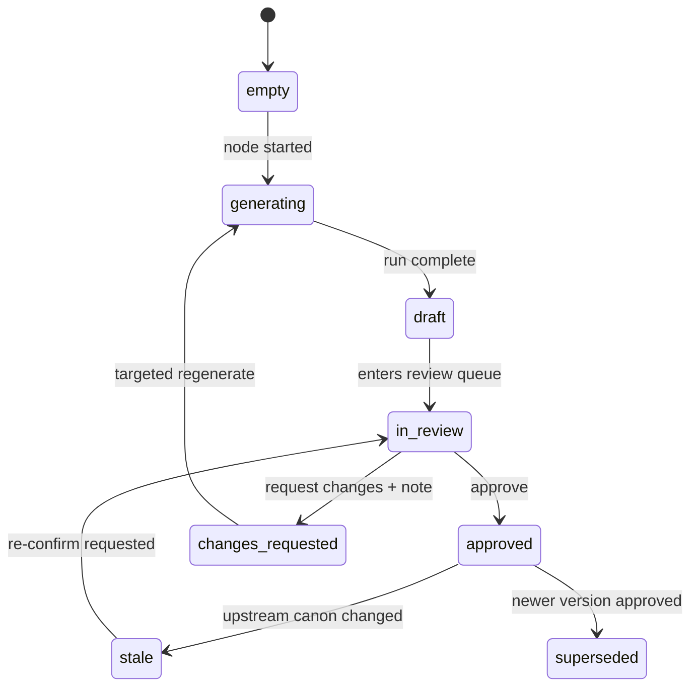

# Fabulation UX Redesign — The Constellation

> Produced by the [`ux-designer`](../../agents/ux-designer.md) persona in **grounded mode** against `fabulationary/fabulation` @ `cc6726c` (2026-07). Interactive prototype of the navigation model: [`prototype.html`](prototype.html).

## Executive summary

Fabulation today is a **linear pipeline dashboard**: one prompt, four fixed phases, one blocking approve/revise checkpoint per phase. The redesign turns it into an **IP universe map**: a 3D node-graph ("constellation") in which the foundation loop — Spark → World Bible → Canon — forms the trunk, and transmedia pillars (Games, Video, Audio, Physical & Visual, Marketing) branch outward from the approved canon. Every artifact becomes a first-class object with its own review state, feedback thread, and version history; approval becomes a persistent, per-artifact ledger instead of a fleeting whole-phase modal moment.

**Design thesis:** the product's real shape is a branching universe, not a queue — the moment the UI shows that shape, review tracking, pillar expansion, and "where am I?" all become properties of one graph instead of three separate features.

## Current-state audit

Stack: FastAPI (`server.py`) + vanilla JS/CSS dashboard (`static/index.html`, `static/app.js`, `static/app.css`), SSE log stream, markdown artifacts written to `output/<PROJECT>/<folder>/`.

### Findings

| # | Finding | Source |
|---|---------|--------|
| 1 | The phase timeline is a flat vertical list of 4 items; the branching transmedia structure (bible feeding games, video, marketing in parallel) is invisible | `static/index.html:66–99` |
| 2 | Review granularity is the whole phase: one Approve & Advance / Request Revision pair, one feedback textarea | `static/index.html:146–152`, `server.py:875–968` |
| 3 | Requesting a revision regenerates the **entire phase** — the single feedback string is appended to every task in the phase, even artifacts the user was happy with | `server.py:300–343, 455, 596` |
| 4 | Feedback is ephemeral: held in an in-memory global, never persisted; there is no history of what was asked for across rounds | `server.py:37` (`USER_APPROVAL`) |
| 5 | The review pane shows a concatenation of the phase's documents in one scroll; no per-document navigation or per-document decision | `server.py:1042–1176` (`/api/review/{phase}`) |
| 6 | Versioning is filename suffixes (`world_bible_rules_2.md`) with "latest" chosen by file mtime; no diff between rounds, older versions land in `Archive/` with no lineage | `server.py:232–277` (`save_output_file`, `get_latest_file`) |
| 7 | All pipeline state is process-global (`PIPELINE_STATE`, `CURRENT_PHASE`); a server restart or browser refresh mid-run loses "where you are" | `server.py:29–38` |
| 8 | One project at a time, switched via a free-text field; no project gallery or per-project status | `static/index.html:44`, `server.py:32` |
| 9 | Pillars are hardwired: each phase is a bespoke function naming its agents and output folders, so adding a pillar (e.g. Audio) means new backend code and new frontend timeline HTML | `server.py:286, 437, 577, 649`; `create_output_dirs` at `server.py:279` |

### What works and is preserved

- The **checkpoint loop itself** — generate → human review → approve or steer — is the product's soul. The redesign multiplies it, it does not remove it.
- **Live agent visibility**: the SSE console and Agent Activity Ledger with token counts (`static/app.js:74–170`) give real trust in the machine; they move into a collapsible activity drawer, unchanged in substance.
- **Prompt-first intake** (`static/index.html:57–64`) and the "skip bible / reuse existing" affordance survive as the Spark flow.
- **Markdown artifacts on disk** stay the source of truth; the redesign adds metadata around them, not a database replacing them.
- The **glass/neon visual language** (`static/app.css`) extends naturally to a dark-space constellation scene.

## Users and jobs

Stated by the product owner: **solo creator today, small team later.** Design the data model for the team case, expose the solo case first (persona rule 5).

Jobs, in order of frequency:

1. Turn a spark into an approved canon (world bible).
2. Expand the canon into pillar outputs (game design, scripts, campaigns…).
3. Review generated work, steer it with feedback, and approve it — and later, **trust the record** of what was approved when.
4. See at a glance where the universe stands and what needs their attention next.
5. Export/pitch the portfolio.

`assumption — validate with users`: creators will review artifacts one at a time rather than wanting a single combined phase read; the per-artifact model below still permits a combined reading view if this proves wrong.

## Object model

Fix the model before the screens. The UI implies these nouns:

- **Universe (Project)** — one IP; owns everything below.
- **Pillar** — a transmedia vertical (Games, Video, Audio, Physical & Visual, Marketing) declared by a manifest (see Extensibility). The foundation trunk is a built-in pseudo-pillar ("Core").
- **Node (Stage)** — a step within the trunk or a pillar (e.g. "World Bible", "GDD", "Screenplay"). A node groups artifacts and agent runs.
- **Artifact** — one generated document or media asset, with versions.
- **Review Round** — one generate→review cycle on an artifact version.
- **Feedback Note** — persisted steering text, attached to an artifact (optionally to a text selection within it).
- **Approval Record** — append-only: `{artifact, version, reviewer_slot, decision, note, timestamp}`.
- **Agent Run** — one model call: agent, tokens, duration, inputs (already surfaced in the ledger today).

### Artifact state machine



**Node state is derived, never stored:** `locked` (upstream not approved) → `ready` → `generating` → `in_review` → `changes_requested` → `approved`; plus `stale` (was approved, upstream changed) and `planned` (pillar manifest present, not yet implemented). This derivation is what lets one graph honestly drive both the constellation and the fallback view.

**Targeted revision** replaces whole-phase regeneration (finding 3): a Feedback Note attaches to one artifact; regeneration re-runs only that artifact's tasks with the note plus prior context; dependents flip to `stale` rather than being silently regenerated.

**Stale propagation, not revocation:** approving a canon change never deletes downstream approvals — it marks them `stale` and queues re-confirmation. The creator sees exactly what a lore change costs before making it.

### Solo → team growth path

An Approval Record always names a **reviewer slot**, not a person. Solo mode has one slot, `creator`, auto-assigned. Team mode later adds slots per node type (e.g. `art-director` approves visual artifacts, `narrative-lead` approves canon) with assignment and a quorum rule per node. Nothing in the solo UI changes shape when slots multiply — node chips gain per-slot status dots.

## Information architecture and navigation

One graph model, two synchronized views. Neither is the only way to do anything (persona rule 4).

### Constellation view (primary) — 3D WebGL node graph

The metaphor's grammar — every visual property means one thing:

| Property | Meaning |
|----------|---------|
| **Center ("the sun")** | The Canon — the approved World Bible. Everything orbits what is true about the IP. |
| **Trunk (pre-canon spine)** | Foundation loop: Spark → Bible drafts (rules / factions / characters / visuals sub-nodes) → Continuity check → Critique → Canon |
| **Branch** | One pillar, radiating from the Canon at a fixed angle; branch length grows as stages complete |
| **Node size** | Scope: stage nodes large, artifact sub-nodes small (appear on focus — level-of-detail) |
| **Node color/treatment** | State: `approved` gold/solid · `in_review` amber pulse · `generating` cyan animated · `changes_requested` red · `ready` white outline · `locked` dim · `stale` desaturated flicker · `planned` ghost wireframe |
| **Edge** | Dependency; a light pulse travels the edge while context flows into a running generation |
| **Distance from center** | Downstream-ness — how many approvals stand between this node and canon |
| **Halo + camera focus** | "You are here": the node you are working in |

Interactions: drag = orbit · scroll = zoom · hover = label + status tooltip · click = select and open the Node Panel · double-click = fly-to and expand sub-nodes · `Esc`/breadcrumb = zoom back out. Pending reviews glow brightly enough to be spotted from full orbit — the review queue is visible as light before it is read as a list. Ghost (planned) pillars are clickable: their panel shows intended stages and an "enable pillar" action, making expansion a visible promise instead of a hidden roadmap.

Layout is a **deterministic radial layout, not live force-directed physics**: node positions must be stable across sessions so spatial memory works ("Games is always to the upper right"). `assumption — validate with users`: spatial memory is worth more than the organic motion of a physics layout; the prototype uses fixed radial and this should be felt before being finalized.

### Atlas view (fallback, always one click away)

The same graph as a collapsible tree: trunk first, then pillars, every node with the identical state chip vocabulary. Fully keyboard-navigable, screen-reader friendly, and the automatic fallback on WebGL context loss, low-power devices, and small screens. State parity is a hard rule: anything visible or possible in the constellation is visible and possible in the Atlas.

### Persistent chrome

- **Top bar:** universe switcher (finding 8 → a proper multi-project gallery behind it), progress digest ("6 approved · 2 awaiting review · 1 generating"), Atlas/Constellation toggle.
- **Right: Node Panel** (see Screens).
- **Bottom: Review Queue drawer** — badge count, slides up.
- **Activity drawer:** today's console + agent ledger, collapsed by default, unchanged internals.

## Screens

| Screen | Purpose | Empty state | Loading state | Error state |
|--------|---------|-------------|---------------|-------------|
| **Universe home** | Constellation (or Atlas) + chrome | New universe: lone Spark node pulsing at center, intake panel open | Skeleton starfield while graph state loads | Banner + automatic Atlas fallback on WebGL failure |
| **Spark / intake** | Evolution of today's prompt card: concept, tone, characters, which pillars to seed, model choice | Blank guided form with the current CARFIGHT-style example as placeholder | Submit → Spark node transitions to `generating` | Validation inline; API failure keeps text (never lose a typed spark) |
| **Node Panel** | Everything about one node: artifact list with per-artifact state, latest preview, version history with diff, feedback thread, actions (Approve · Request changes · Regenerate · Re-confirm stale) | "No artifacts yet — this node unlocks when *X* is approved" | Per-artifact skeleton rows | Per-artifact retry, run log link |
| **Review Queue** | Every `in_review` and `stale` artifact across the universe; approve here or jump to node; shows consequences ("Approving Canon unlocks Games, Video, Marketing") | "Nothing awaits you" + next suggested action | Queue skeleton | Failed decision → toast, item stays queued |
| **Artifact reader** | Full markdown/media view; select text → attach a Feedback Note to the selection; version diff toggle | — (only reachable with content) | Progressive markdown render | Raw-file fallback link |
| **Pillar overview** | Per-pillar dashboard: stage progress, agents involved, outputs, enable/disable | Ghost pillar: intended stages + "enable" | — | — |

## Review and approval model

- **Per-artifact decisions** (replaces findings 2, 3, 5): each artifact carries Approve / Request changes independently; a node auto-advances when its required artifacts are approved. "Approve all in node" exists for the current whole-phase habit.
- **Persistent feedback threads** (replaces finding 4): every Feedback Note is stored with the version it addressed and shown beside the regenerated result — the creator can see whether the note was honored.
- **Version history with diffs** (replaces finding 6): versions become explicit records (`v1, v2 …` with parent links) rather than mtime races; the reader offers a side-by-side or inline diff of any two versions. Files on disk keep their names; a small `manifest.json` per node adds the lineage.
- **Approval ledger:** an append-only, filterable history — "what did I approve, when, at which version, with what note." This is also the team-mode audit trail, already shaped for reviewer slots.
- **Where you are** is now derived and durable: state lives on disk with the project (fixing finding 7), so a refresh or restart reopens the universe exactly as it stood.

## Extensibility model — pillar manifests

Replace the four hardwired `run_phase_*` functions (finding 9) with declarative **pillar manifests** the backend iterates and the graph renders:

```yaml
# pillars/audio.yaml
id: audio
name: Audio
status: planned            # planned | enabled
color: "#b48bff"
depends_on: [core.canon]
review_slots: [creator]     # team mode: [creator, audio-director]
stages:
  - id: audio-concept
    name: Sonic Identity
    agents: [sound-director.md]
    artifacts: [sonic_identity.md]
  - id: audio-drama
    name: Audio Drama Pilot
    agents: [screenplay-writer.md, sound-director.md]
    artifacts: [audio_drama_script.md]
    depends_on: [audio-concept]
```

A new vertical is then a manifest plus agent `.md` files — no frontend change (the constellation renders whatever manifests declare, ghosting `status: planned`) and no new backend endpoints. Initial manifest set, mapping today's hardwired behavior plus the owner's requested categories:

| Pillar | Initial stages | Today's source |
|--------|----------------|----------------|
| **Core (trunk)** | Spark → Bible (rules/factions/characters/visuals) → Continuity → Critique → Canon | Phase 1 (`server.py:286`) |
| **Games** | GDD (loop/vehicles/combat) → Unreal whitebox prototype → QA/telemetry | Phases 2 + 4 (`server.py:437, 649`) |
| **Video** | Screenplay → Visual style guide → Trailer edit | Phase 3 (`server.py:577`) |
| **Marketing** | ARG campaign → Advertising → Social accounts → Community growth | Phase 3 partial; expansion per owner |
| **Business** | Monetization & licensing → Pitch portfolio | Phase 2 partial |
| **Audio** *(planned)* | Sonic identity → Audio drama → Soundtrack | new |
| **Physical & Visual** *(planned)* | Comic/graphic novel → Art book → Merch line → Experiences | new |

## 3D implementation notes

- **Recommendation:** three.js (react-three-fiber if the frontend adopts React — see Open questions). Instanced meshes for nodes, bezier tubes/line segments for edges, `CSS2DRenderer` HTML overlays for labels so text stays crisp and accessible.
- **Feasibility flags:** WebGL on low-end/integrated GPUs — budget 60fps at ~200 nodes, LOD collapses artifact sub-nodes beyond focus distance; handle `webglcontextlost` by switching to Atlas view with a toast; honor `prefers-reduced-motion` (no pulses, no fly-to animation, crossfade instead).
- Precompute the radial layout server-side or at load; never re-layout on state change — only restyle.
- The bundled [`prototype.html`](prototype.html) demonstrates the grammar with raw WebGL for the graph substrate and DOM overlays for labels/panels; production should use three.js rather than extending the raw-GL approach.

## Migration path

Current UI → new home:

| Today | Becomes |
|-------|---------|
| Prompt card + skip-bible button | Spark intake flow (skip = "adopt existing bible as Canon") |
| Pipeline Phases timeline | Constellation trunk + branches (Atlas view is its literal descendant) |
| Document Review Center + steering panel | Node Panel + Review Queue + Artifact reader |
| Console + Agent Activity Ledger | Activity drawer, unchanged internals |
| Output Directory tab | Artifact lists inside Node Panels; a flat "all files" view stays in the Atlas |
| Model select in header | Per-universe default, per-run override in Spark/Node advanced settings |

Build order (each step ships alone):

1. **Persist the model** — project state file, artifact/version/feedback/approval records, targeted regeneration endpoint. Pure backend; today's UI keeps working. **Required API changes:** `GET /api/universe/{id}` (full graph state) · `POST /api/artifacts/{id}/review` (approve/changes + note) · `POST /api/artifacts/{id}/regenerate` · `GET /api/artifacts/{id}/versions` + diff · `GET/PUT /api/pillars` (manifests). SSE stream gains `node_state` events.
2. **Atlas + Node Panel + Review Queue** replace the single review pane. This is the largest pure-UX win (per-artifact review, feedback history, diffs) with zero WebGL risk. ← **smallest coherent first release ends here**
3. **Constellation view** on the same state, Atlas becomes the toggle/fallback.
4. **Pillar manifests** drive both backend execution and graph rendering; ghost pillars appear.

## Open questions

1. **Fixed radial vs force-directed layout.** *Recommendation: fixed radial* — spatial memory beats organic motion for a workspace you return to daily; revisit only if the graph grows beyond ~2 levels per pillar.
2. **Adopt a frontend framework?** The vanilla JS app will strain under the Node Panel/queue state. *Recommendation:* stay vanilla through step 2 if preferred, but adopt React + react-three-fiber at step 3 rather than hand-rolling a second state system inside WebGL code.
3. **Does approval auto-start downstream generation?** *Recommendation:* no — approval unlocks; the creator explicitly ignites the next stage from the Node Panel, with an opt-in "auto-advance" toggle per pillar for hands-off runs.
4. **Multi-universe home.** *Recommendation:* yes — a small gallery ("multiverse") listing universes with their progress digests replaces the free-text project field; cheap once state is persisted (step 1).
5. **Combined phase reading view.** If reviewing artifact-by-artifact proves heavier than today's one-scroll read, add a "read node as one document" mode in the Artifact reader — the model supports it either way.
