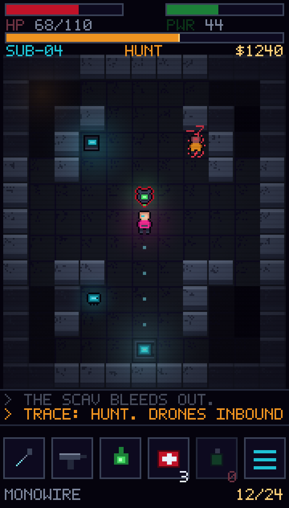

# NEON DESCENT

A cyberpunk turn-based roguelike for Android phones, portrait-locked, 16-bit pixel art.

> **Status: design complete, awaiting review. No game code written yet.**
> Per the agreed sequencing, the design is settled first and the vertical slice is built
> after this document set is approved.

This directory is a self-contained design prototype and does not interact with the skills
catalog that makes up the rest of this repository.

---

## Documents

| Doc | What's in it |
| --- | --- |
| **[docs/DESIGN.md](docs/DESIGN.md)** | The game. Pillars, core loop, Trace clock, chrome/Instability, combat, enemies, structure, controls, scope, and the open questions worth arguing about |
| **[docs/ARCHITECTURE.md](docs/ARCHITECTURE.md)** | Stack rationale, resolution/scaling math, module layout, turn pipeline, determinism, persistence, testing strategy, Android shell, build sequencing |
| **[docs/ART-DIRECTION.md](docs/ART-DIRECTION.md)** | SPRAWL-36 palette with fixed color semantics, pixel-exact screen layout, sprite and animation budgets, lighting, the Instability glitch language |

## Mockup

`mockup/index.html` renders the portrait HUD and a sample Act I scene at the real logical
resolution (180 × 316), integer-scaled — the same pipeline the shipping renderer will use.
It is static art with no simulation. Open it in any browser, or view the rendered output:

Everything in the image is drawn from the SPRAWL-36 palette in code: no external assets,
no fonts (the 5×7 face is a bitmap defined inline), no libraries.

What it demonstrates: the fixed HUD proportions, the 11×13 tile viewport, the Trace bar's
prominence, fog-of-war's three states, additive neon glow, silhouette threat outlines
(dashed = the enemy has seen you, solid = it hasn't), tap-to-path preview dots, and the
six-slot thumb-reachable action bar.

---

## Decisions locked before writing

| Question | Answer |
| --- | --- |
| Stack | HTML5 canvas + TypeScript, wrapped with Capacitor for Android |
| Game feel | Traditional turn-based grid roguelike |
| Controls | Swipe to move/attack, tap to path, long-press to inspect |
| Process | Design docs first, vertical slice after review |

## What happens after approval

Build order is [ARCHITECTURE.md §12](docs/ARCHITECTURE.md#12-sequencing). The vertical slice
is Act I in full — 4 floors, the Trace clock including the Hunter-Killer, chrome and
Instability, four enemies, and the Warden — scoped in [DESIGN.md §10](docs/DESIGN.md#10-scope-what-the-vertical-slice-is).

Six open questions are flagged for the review in
[DESIGN.md §11](docs/DESIGN.md#11-risks-and-open-questions). The two most worth a decision
before any code exists:

1. **Instability lying to the player's interface** — rendering enemies as friendly at high
   chrome is the most interesting and most dangerous idea in the design.
2. **8-directional swipe accuracy** — unproven on a small screen; the fallback is 4-directional
   swipes with diagonals reachable only via tap-to-path.
