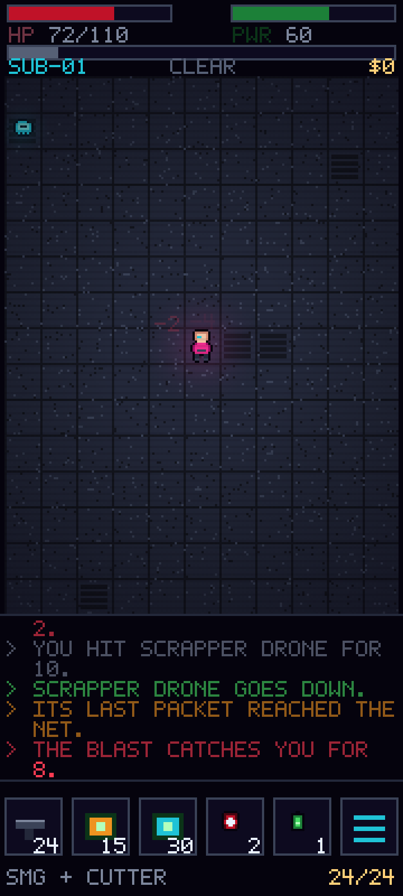
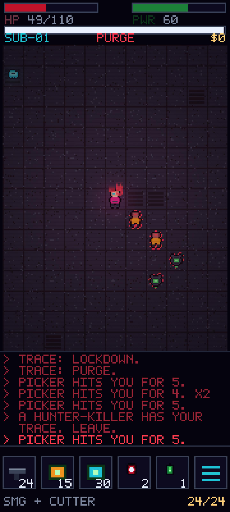
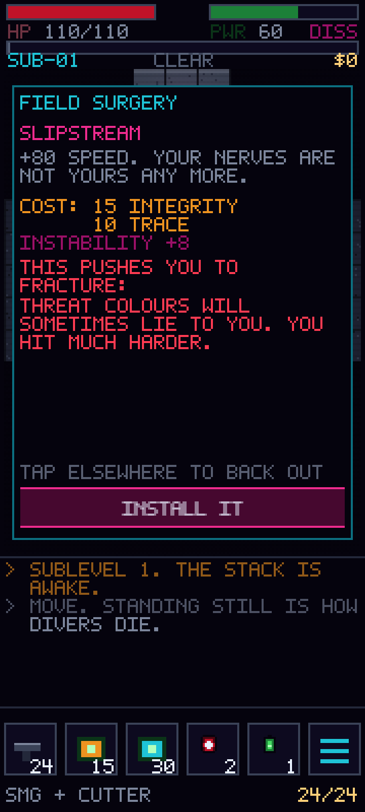

# NEON DESCENT

A cyberpunk turn-based roguelike for Android phones, portrait-locked, 16-bit pixel art.

> **Status: design complete, Act I vertical slice playable.**
> The design docs were written first and remain the source of truth; the slice in
> [`game/`](game/) implements Act I of them. Two open questions were defaulted to my
> recommendations to get the prototype moving — both are one-line reversals, and both
> are still yours to overrule (see [Open questions](#open-questions-still-yours-to-call)).

This directory is a self-contained prototype and does not interact with the skills
catalog that makes up the rest of this repository.

---

## Run it

```bash
cd game && npm install && npm run dev
```

35 tests (`npm test`), a headless balance harness (`npm run balance`), 20.9 KB gzipped.
See [game/README.md](game/README.md) for controls, scope, and the three real bugs the
harness caught.

## Documents

| Doc | What's in it |
| --- | --- |
| **[docs/DESIGN.md](docs/DESIGN.md)** | The game. Pillars, core loop, Trace clock, grafts/Instability, combat, enemies, structure, controls, scope, and the open questions worth arguing about |
| **[docs/ARCHITECTURE.md](docs/ARCHITECTURE.md)** | Stack rationale, resolution/scaling math, module layout, turn pipeline, determinism, persistence, testing strategy, Android shell, build sequencing |
| **[docs/ART-DIRECTION.md](docs/ART-DIRECTION.md)** | VERGE-36 palette with fixed color semantics, pixel-exact screen layout, sprite and animation budgets, lighting, the Instability glitch language |

## Screens

All captured from the running build at 720×1600, integer-scaled ×4. Everything is drawn
in code from the VERGE-36 palette — no external assets, no font files, no libraries.

| | |
| --- | --- |
|  |  |
| Sublevel 1, CLEAR. Player centred, six-slot action bar, Trace bar under the meters. | PURGE. Trace maxed and pulsing, the palette desaturated toward BLOOD, enemies outlined dashed because they have seen you. |



The install screen, and the reason the Instability mechanic is a mechanic rather than a
bug: before you accept a Slipstream you are told, in plain words, that threat colours
will start lying to you.

`mockup/index.html` is the original static layout study
([rendered](mockup/layout-mockup.png)), kept because it documents the pixel-exact HUD
grid independent of game state.

---

## Decisions locked before writing

| Question | Answer |
| --- | --- |
| Stack | HTML5 canvas + TypeScript, wrapped with Capacitor for Android |
| Game feel | Traditional turn-based grid roguelike |
| Controls | Swipe to move/attack, tap to path, long-press to inspect |
| Process | Design docs first, then the slice |

## Open questions, still yours to call

Six are flagged in [DESIGN.md §11](docs/DESIGN.md#11-risks-and-open-questions). Two had to
be defaulted to build the slice; both are trivially reversible:

1. **Does Instability get to lie to the player's interface?** Built as recommended: the
   FRACTURE tier does mis-colour threat outlines, but only after an install screen that
   states the consequence in plain words. Reverting means deleting one branch in
   `render/scene.ts`.
2. **8-way swipe, or 4-way with diagonals via tap-to-path?** Built as 8-way with a
   tunable cone angle, a `fourWay` fallback flag already wired through settings, and a
   `reversalCount` telemetry counter in the gesture recognizer to settle it with data
   rather than argument.

The other four are untouched and unprejudiced by the slice — Act III's rotating layout,
Act II's corridor sightlines against an 11-tile viewport, run length, and free inspection.

## What the slice changed about the design

Building it moved three numbers, each for a reason worth recording:

- **Hunter-Killer speed 120 → 100.** DESIGN.md §6.4 promises you can outrun it to the
  elevator. At 120 you provably could not, and the harness measured it causing 60% of
  all deaths. The design was right and the number was wrong.
- **Grafted speed 130 → 115, damage 5–9 → 4–8.** 42% of deaths from one Act I enemy.
  Now 33%, still above my own 25% line — flagged rather than tuned further, because the
  remaining gap may be an artifact of a bot that melees everything.
- **Floor tiles one ramp step lighter.** In an open cavern with no walls in frame, the
  map read as a black rectangle. Legibility beats atmosphere (ART-DIRECTION.md §0).
