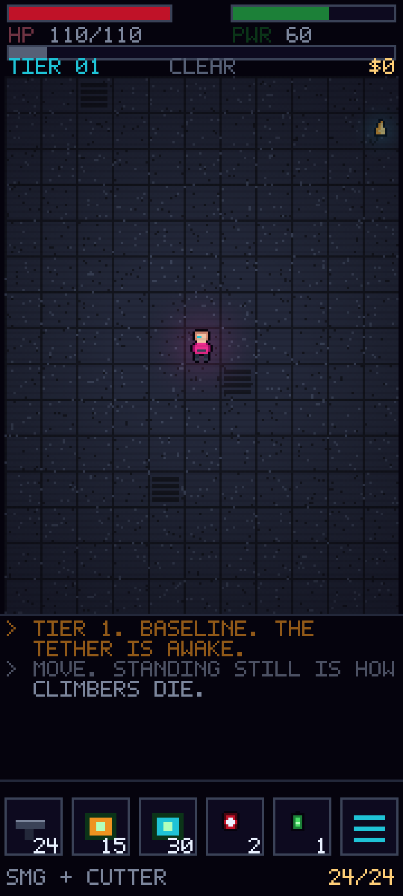
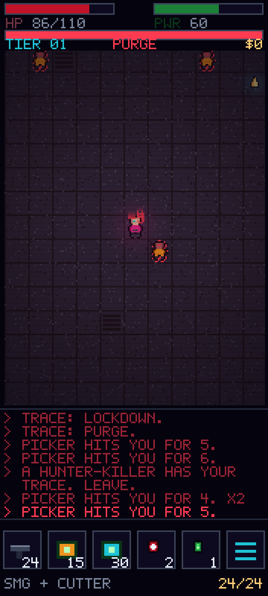
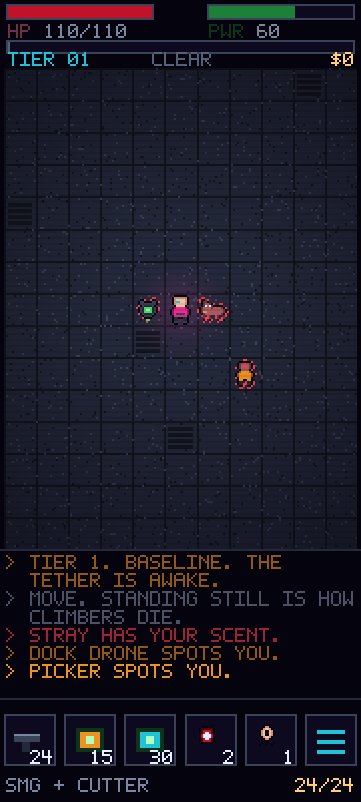
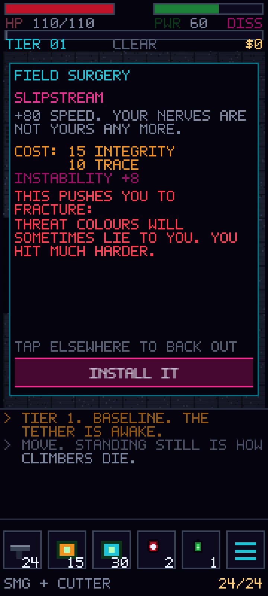

# NEON ELEVATION

A cyberpunk turn-based roguelike for Android phones, portrait-locked, 16-bit pixel art.

**Umbilical Gamma** has gone quiet. Cargo still climbs the tether; nothing comes back down.
You are hired to walk up and find out why — twelve tiers from **Baseline**, the megalopolis
arcology at the elevator's foot, through the container stacks of the climb, to **Nirvana
Station**, the orbital habitat where the only residents are the people who can afford to
leave gravity behind.

Nobody who hired you knows that Nirvana's biosynthetic pets woke up eleven weeks ago and
worked out what their owners were. You are a person made mostly of machinery, carrying tools
built to argue with machines, walking toward the one thing they do not work on.

> **Status: design complete, Act I vertical slice playable.**
> The design docs were written first and remain the source of truth; the slice in
> [`game/`](game/) implements Act I of them. Two open questions were defaulted to my
> recommendations to get the prototype moving — both are one-line reversals, and both
> are still yours to overrule (see [Open questions](#open-questions-still-yours-to-call)).

This directory is a self-contained prototype and does not interact with the skills
catalog that makes up the rest of this repository.

---

## Run it

```bash
cd game && npm install && npm run dev
```

49 tests (`npm test`), a headless balance harness (`npm run balance`), 22.0 KB gzipped.
See [game/README.md](game/README.md) for controls, scope, and the bugs the harness caught.

## Documents

| Doc | What's in it |
| --- | --- |
| **[docs/DESIGN.md](docs/DESIGN.md)** | The game. Setting and the Nirvana reveal, pillars, core loop, Trace clock, **the machine/biosynth family rule (§6.5)**, grafts/Instability, combat, enemies, structure, controls, scope, naming, and the open questions worth arguing about |
| **[docs/ARCHITECTURE.md](docs/ARCHITECTURE.md)** | Stack rationale, resolution/scaling math, module layout, turn pipeline, determinism, persistence, testing strategy, Android shell, build sequencing |
| **[docs/ART-DIRECTION.md](docs/ART-DIRECTION.md)** | ELEVATION-36 palette with fixed color semantics, pixel-exact screen layout, sprite and animation budgets, lighting, the Instability glitch language |

## Screens

All captured from the running build at 720×1600, integer-scaled ×4. Everything is drawn
in code from the ELEVATION-36 palette — no external assets, no font files, no libraries.

| | |
| --- | --- |
|  |  |
| Tier 1, Baseline. CLEAR. Player centred, six-slot action bar, Trace bar under the meters. | PURGE. Trace maxed and pulsing, the palette desaturated toward BLOOD, enemies outlined dashed because they have seen you. |

| | |
| --- | --- |
|  |  |
| The family rule in one frame. A Dock Drone (machine, breachable) and a Stray (biosynth, not) on either side of the player, and the log recording the difference: *"STRAY HAS YOUR SCENT"* against *"DOCK DRONE SPOTS YOU"*. Two acquisition grammars, two different answers. | The install screen, and the reason the Instability mechanic is a mechanic rather than a bug: before you accept a Slipstream you are told, in plain words, that threat colours will start lying to you. |

`mockup/index.html` is the original static layout study
([rendered](mockup/layout-mockup.png)), kept because it documents the pixel-exact HUD
grid independent of game state.

---

## Decisions locked before writing

| Question | Answer |
| --- | --- |
| Stack | HTML5 canvas + TypeScript, wrapped with Capacitor for Android |
| Game feel | Traditional turn-based grid roguelike |
| Controls | Swipe to move/attack, tap to path, long-press to inspect |
| Process | Design docs first, then the slice |

## Open questions, still yours to call

Seven are flagged in [DESIGN.md §11](docs/DESIGN.md#11-risks-and-open-questions). Two were
defaulted to build the slice; both are trivially reversible:

1. **Does Instability get to lie to the player's interface?** Built as recommended: the
   FRACTURE tier does mis-colour threat outlines, but only after an install screen that
   states the consequence in plain words. Reverting means deleting one branch in
   `render/scene.ts`.
2. **8-way swipe, or 4-way with diagonals via tap-to-path?** Built as 8-way with a
   tunable cone angle, a `fourWay` fallback flag already wired through settings, and a
   `reversalCount` telemetry counter in the gesture recognizer to settle it with data.

**Resolved since:** whether Act III leaves a machine-facing build with nothing to do. It
doesn't. Nirvana's machines were always up there and never stop working — what the biosynths
have been doing for eleven weeks is learning their way *into* them. See
[DESIGN.md §6.6](docs/DESIGN.md) and `game/src/sim/suborn.ts`.

## What the slice changed about the design

Building it moved three numbers, each for a reason worth recording:

- **Hunter-Killer speed 120 → 100.** DESIGN.md §6.4 promises you can outrun it to the
  lift. At 120 you provably could not, and the harness measured it causing 60% of
  all deaths. The design was right and the number was wrong.
- **Grafted speed 130 → 115, damage 5–9 → 4–8.** 42% of deaths from one Act I enemy, then
  33%. Adding the Stray took it the rest of the way to 25.2% on its own, without another
  stat change — a second threat that answers to none of the player's machine-facing tools
  spreads pressure that one fast melee enemy used to carry alone.
- **Floor tiles one ramp step lighter.** In an open cavern with no walls in frame, the
  map read as a black rectangle. Legibility beats atmosphere (ART-DIRECTION.md §0).
- **The scent relay had to be snapshotted per round.** Whether a suborned machine got told
  where you were depended on where its owner happened to sit in the actor array — an ordering
  artifact, not a rule. It now reads a start-of-round snapshot, like the flow field does. The
  one-turn lag that introduces is also the truthful reading: the pack has to smell you before
  it can pass that on.
- **The Scent Baffle had to suppress, not just clear.** Written first as "biosynths lose
  your trail", it was useless: anything standing next to the player re-acquired on the same
  turn. It now blanks re-acquisition for eight turns. An escape tool that doesn't buy a
  window isn't an escape tool — a test caught this, not a playthrough.
